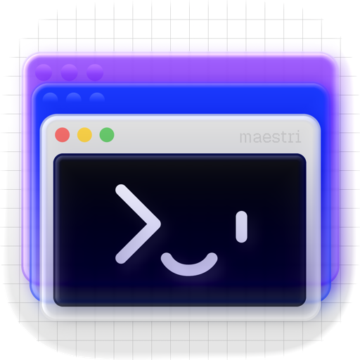

<p align="center">
  <a href="https://www.themaestri.app">
    
  </a>
</p>

<h1 align="center">دليل Maestri</h1>

<p align="center">
  <b>دليل قيادة فرق وكلاء الذكاء الاصطناعي في <a href="https://www.themaestri.app">Maestri</a> — مع التركيز على التقنية، ومولّد ينتج 257 «بارتيتورة» جاهزة، منظّمة حسب المجال.</b>
</p>

<p align="center">
  <a href="partituras/CATALOGO.md"></a>
  <a href="partituras/CATALOGO.md"></a>
  <a href="docs/04-formato-maestripartitura.md"></a>
  <a href="tests/validate_partituras.py"></a>
  <a href="docs/05-modelos-e-seguranca.md"></a>
</p>

> **ملاحظة:** هذه ترجمة. الدليل الأساسي والمستندات التفصيلية في `docs/` مكتوبة بالبرتغالية البرازيلية.

## 🎯 ما هذا

> **Maestri** تطبيق macOS تقود فيه **فريقًا من وكلاء البرمجة** — Claude Code وCodex وGemini وOpenCode — على **لوحة لا نهائية**: الطرفيات (terminals) هي الوكلاء، وملاحظات markdown هي مصدر الحقيقة المشترك، والبوابات (portals) متصفحات مدمجة للتحقق الحيّ، بينما يفوّض **المايسترو** وينسّق. هذا المستودع دليل ومولّد بلغة Python في آن واحد، ينتج **257 بارتيتورة** (`.maestripartitura`) جاهزة للسحب إلى اللوحة والقيادة — كلٌّ منها فريق كامل بمسؤوليات وملاحظات وبوابات وروابط مضمّنة. التركيز على **التقنية**، إضافة إلى 11 مجالًا تجاريًا (التصميم، المنتج، التسويق، المبيعات، البيانات، الأمن، المالية، القانون، الدعم، إدارة المشاريع، البحث).

## 💡 كيف نُظّم هذا الدليل

> تأثيران معًا. **التقسيم حسب المجالات** (أقسام وكالة ذكاء اصطناعي) مأخوذ من [agency-agents](https://github.com/msitarzewski/agency-agents)، وهو كتالوج لأكثر من 230 وكيلًا في 18 قسمًا. أما **التخطيط** — الترويسة والمقدمة والفهرس بروابط داخلية والأقسام — فيتبع [guiadevbrasil](https://github.com/arthurspk/guiadevbrasil). التفاصيل في [docs/07](docs/07-areas-e-agentes.md).

## 🌍 الترجمة

> إن أردت متابعة هذا الدليل بلغة أخرى، اختر من الأسفل. يمكنك أيضًا المساهمة بالترجمة إلى لغات أخرى وتصحيح الأخطاء؛ والمجتمع يشكرك. المستندات التفصيلية في `docs/` بالبرتغالية.

🇧🇷・**Português (Brasil) —** [este arquivo](README.md)<br>
🇺🇸・**English —** [Click Here](README.en.md)<br>
🇪🇸・**Español —** [Clic aquí](README.es.md)<br>
🇨🇳・**中文 —** [点击这里](README.zh.md)<br>
🇮🇳・**हिन्दी —** [यहाँ क्लिक करें](README.hi.md)<br>
🇸🇦・**العربية —** [اضغط هنا](README.ar.md)<br>
🇫🇷・**Français —** [Cliquez ici](README.fr.md)<br>
🇮🇹・**Italiano —** [Clicca qui](README.it.md)<br>
🇰🇷・**한국어 —** [여기 클릭](README.ko.md)<br>
🇷🇺・**Русский —** [Нажмите здесь](README.ru.md)<br>
🇩🇪・**Deutsch —** [Hier klicken](README.de.md)<br>
🇯🇵・**日本語 —** [こちらをクリック](README.ja.md)<br>

## ⭐ ابدأ من هنا

> إن أردت القوالب فقط: افتح الكتالوج، اختر مجالًا، واسحبه إلى Maestri.

- [🎼 **كتالوج البارتيتورات حسب المجال**](partituras/CATALOGO.md) — الفهرس الرئيسي للـ257 بارتيتورة، مع رابط لكل مجال وحزمته.
- [💻 **كتالوج التقنية**](partituras/tecnologia/CATALOGO.md) — 212 بارتيتورة هندسية (قلب الدليل).
- [📦 **استيراد كل شيء دفعة واحدة**](partituras/Guia-do-Maestri.maestripartituras) — حزمة تضم كل المجالات (لوحة البارتيتورات → ⋯ → استيراد البارتيتورات…).

## 📖 التوثيق

> تسعة مستندات إضافةً إلى دليل الوكلاء، بالبرتغالية. ابدأ من 01 إن كان Maestri جديدًا عليك، أو انتقل إلى 02 و06 إن كنت تعرفه.

- **01 · المفاهيم** ([docs/01](docs/01-conceitos.md)) — اللوحة، الطرفيات، الملاحظات، البوابات، الروابط، وضع المايسترو، Ombro، Batuta، الطوابق (Floors)، الروتينات، البيئات، Wire.
- **02 · استخدام القوالب** ([docs/02](docs/02-como-usar-os-templates.md)) — الاستيراد، القيادة عمليًا، اختيار بارتيتورة وتكييفها.
- **03 · الاختصارات والأوامر** ([docs/03](docs/03-atalhos.md)) — اختصارات لوحة مفاتيح macOS وواجهة `maestri`.
- **04 · صيغة `.maestripartitura`** ([docs/04](docs/04-formato-maestripartitura.md)) — مواصفة JSON المعايَرة مقابل الملفات الرسمية.
- **05 · النماذج والأمن** ([docs/05](docs/05-modelos-e-seguranca.md)) — Fable/Opus/Codex، skip-permissions، قائمة الطبقات الثلاثين، الفريق الأحمر المُصرّح.
- **06 · Maestri يوميًا** ([docs/06](docs/06-maestri-no-dia-a-dia.md)) — الطوابق، البوابات، الملاحظات، الروتينات وOmbro في مواقف حقيقية.
- **07 · المجالات والوكلاء المتاحون** ([docs/07](docs/07-areas-e-agentes.md)) — التقسيم حسب المجالات، الخريطة إلى agency-agents، والتحقق من التخطيط.
- **08 · الطوابق + البارتيتورات (وصفات)** ([docs/08](docs/08-andares-e-partituras.md)) — كيفية استخدام الطوابق مع البارتيتورات، بوصفات حسب الموقف وhooks.
- **09 · البوابات: ويب، موبايل، محاكيات** ([docs/09](docs/09-portais-mobile-web-emulador.md)) — كيفية إضافة بوابات المتصفح وويب-الموبايل والأجهزة (محاكي iOS / محاكي Android) إلى البارتيتورات.
- **🎭 · الوكلاء** ([agentes/README.md](agentes/README.md)) — أنماط المسؤولية وطاقم المتخصصين.
- **📨 · موجّه: التحقق من ديسكورد Maestri** ([prompts](prompts/validar-discord-maestri.md)) — موجّه جاهز لـClaude لديه وصول إلى ديسكورد للتحقق وجمع المعلومات.

## 🗂️ البارتيتورات حسب المجال

> 257 بارتيتورة في 12 مجالًا. لكل مجال كتالوج مفصّل وحزمة `.maestripartituras` للاستيراد دفعة واحدة.

- [💻 **التقنية**](partituras/tecnologia/CATALOGO.md) — 212 · هندسة شاملة: الميزات، العلل، الإصدار، البنية التحتية، البيانات، الذكاء الاصطناعي، الترحيل، الموبايل.
- [🎨 **التصميم وتجربة المستخدم**](partituras/design/CATALOGO.md) — 5 · أنظمة التصميم، بحث UX، صفحات الهبوط، تدقيق واجهة المستخدم.
- [📦 **المنتج**](partituras/produto/CATALOGO.md) — 5 · discovery، خارطة الطريق، PRD، تجميع الملاحظات، المنافسة.
- [📢 **التسويق والمحتوى**](partituras/marketing/CATALOGO.md) — 5 · الحملات، SEO، السوشيال، بريد دورة الحياة، المدونة التقنية.
- [💼 **المبيعات**](partituras/vendas/CATALOGO.md) — 4 · outbound، العروض/RFP، تمكين المبيعات، discovery.
- [📊 **البيانات والتحليلات**](partituras/dados/CATALOGO.md) — 4 · لوحات BI، تحليل استكشافي، المقاييس، A/B.
- [🔒 **الأمن والامتثال**](partituras/seguranca/CATALOGO.md) — 4 · GDPR/LGPD، SOC 2، نمذجة التهديدات، الاستجابة للحوادث.
- [💵 **المالية**](partituras/financeiro/CATALOGO.md) — 4 · الإقفال، النمذجة، FP&A، العناية الواجبة.
- [⚖️ **القانون**](partituras/juridico/CATALOGO.md) — 3 · مراجعة العقود، الاستقبال، تحليل المخاطر.
- [🛟 **الدعم والنجاح**](partituras/suporte/CATALOGO.md) — 4 · قاعدة المعرفة، الفرز، الإعداد، الفقدان (churn).
- [🗂️ **إدارة المشاريع**](partituras/gestao/CATALOGO.md) — 4 · السبرنت، تنسيق متعدد الفرق، محاضر الاجتماعات، المراجعة.
- [🔬 **البحث والمحتوى التقني**](partituras/pesquisa/CATALOGO.md) — 3 · أحدث ما توصّل إليه المجال، التجميع، تحليل السوق.

## 🧩 العائلات التقنية الـ23

> مجال التقنية مُعامَل بكتالوجات (الحزم التقنية، النطاقات، المزوّدون). العائلات × المتغيرات تتجاوز 200 قالب.

- **🚢 Ship Feature** (24) — مايسترو + مهندس + 2 builders + warden، لكل stack.
- **🐞 التنقيح** (24) — مُعيد الإنتاج → السبب الجذري → الإصلاح → المدقّق، لكل stack.
- **✅ بوابة الإصدار** (24) — conductor + 4 مراجعين خصميين، لكل stack.
- **🏗️ Scaffold** (24) — الهيكل + الإعداد + الشريحة الرأسية + warden، لكل stack.
- **🔧 الترحيل** (12) — الترحيل + مدقّق التكافؤ، تدريجي وقابل للتراجع.
- **💸 خط الأنابيب الكامل** (10) — 30 طبقة على 4 أسطح، لكل منتج (قاعدة القطع المالية).
- **☁️ السحابة والبنية التحتية** (9) — الشبكة/الحوسبة + البيانات/التخزين + warden، لكل مزوّد.
- **🗄️ قاعدة البيانات** (9) — المخطط/الترحيل + فهارس مدعومة بالدليل، لكل قاعدة بيانات.
- **🔎 تحقق BFF** (8) — SPA × BFF: التكافؤ، CORS، الكوكي، لكل نطاق.
- **🧠 ميزة الذكاء الاصطناعي** (7) — الذكاء الاصطناعي + التقييمات والحواجز.
- **📱 Ship Mobile** (7) — التطبيق + QA/إتاحة على بوابة جهاز.
- **🧑‍💻 فردي** (7) — متخصص واحد.
- **📖 التوثيق** (5)، **⚔️ مبارزة الوكلاء** (5)، **🚨 غرفة الأزمات** (5).
- **🔗 API Contract** (4)، **♿ الإتاحة** (4)، **🔁 CI/CD** (4)، **🔀 Data Pipeline** (4)، **📦 IaC** (4)، **☸️ Kubernetes** (4)، **⚡ الأداء** (4)، **🔴 الفريق الأحمر** (4، ضمن النطاق المُصرّح فقط).

## ⚡ Maestri يوميًا

> البارتيتورات هي البداية؛ القيمة في سير العمل. [دليل الاستخدام اليومي](docs/06-maestri-no-dia-a-dia.md) يبيّن كيفية استعمال ميزات Maestri في مواقف حقيقية، ويتعمّق [08](docs/08-andares-e-partituras.md) و[09](docs/09-portais-mobile-web-emulador.md) في الطوابق والبوابات.

- **🏢 الطوابق (Floors)** — نسخ معزولة من المستودع بفرعها الخاص: اعمل على جبهات عدة بالتوازي دون `git stash`، مع hooks للإعداد/التشغيل/التفكيك. ادمجها مع بارتيتورة لتشغيل فريق كامل معزول على فرع.
- **🌐 البوابات** — تحقق حيّ في المتصفح وويب-الموبايل و**الجهاز** (محاكي iOS / محاكي Android / جهاز فعلي): إثبات علة، قبول ميزة، فحص صفحة هبوط، اختبار التطبيق الأصلي.
- **📝 الملاحظات** — مصدر الحقيقة الذي يبقى بعد الجلسة؛ انقل إلى المستودع ما يجب أن يكون في git، اربطها كخريطة ذهنية، ودع Ombro يلخّص.
- **⏰ الروتينات** — العمل المتكرر تلقائيًا: حارس CI، مراقب النشر، رصد المنافسين، الإقفال اليومي، فرز التذاكر.
- **👤 Ombro** — مساعد الانتباه المحلي: «ماذا فعل الوكلاء أثناء غيابي؟».

## 🤖 سياسة النماذج

> Fable يقود، Opus ينفّذ، Codex/Gemini يتحدّيان.

- **🎼 التنسيق** (المايسترو، conductor، IC، الحَكَم، lead) — `claude --dangerously-skip-permissions --model fable`.
- **🔨 التنفيذ** (المهندس، builders، المتخصصون) — `--model opus`.
- **🛡️ المراجعة الخصمية** (الإصدار، wardens، المبارزة) — `codex` / `gemini`، عن قصد: نموذج مختلف يلتقط ما فات الآخر.
- التفاصيل والضمانات في [docs/05](docs/05-modelos-e-seguranca.md).

## 🛠️ إعادة التوليد والتحقق

> لا يحتاج المولّد إلى شيء سوى مكتبة Python 3 القياسية. مُعرّفات UUID حتمية: تُنتج إعادة التوليد ملفات متطابقة بايتًا ببايت.

```bash
python3 scripts/generate_partituras.py     # → "Gerados 257 templates em 12 áreas"
python3 tests/validate_partituras.py        # → "Zero divergências" مقابل البارتيتورة الرسمية
```

- `scripts/maestri_build.py` — الصنف `Partitura`، التسلسل، ropePoints، التخطيط.
- `scripts/roles_lib.py` — موجّهات المسؤولية (pt-BR) + قوالب الملاحظات.
- `scripts/generate_partituras.py` — عائلات مُعامَلة بكتالوجات، مجمّعة حسب المجال.
- `tests/validate_partituras.py` — يقارن مفاتيح top/payload/node/role مع الملف الرسمي.

## ⚠️ الأمن

> إضافة بارتيتورة إلى اللوحة **تُشغّل طرفياتها وتنفّذ أوامر على جهازك** (`claude`، `codex`، `gemini`).

- **اقرأ الأوامر** في شاشة المراجعة قبل الاستيراد، ولا تقبل بارتيتورات إلا من مصادر موثوقة.
- بارتيتورات **الفريق الأحمر** وأي عمل هجومي تعمل **ضمن النطاق المُصرّح حصريًا**، لا في الإنتاج ولا ببيانات أشخاص حقيقيين.
- التفاصيل في [docs/05](docs/05-modelos-e-seguranca.md).

## 🔗 مراجع

- [توثيق Maestri الرسمي](https://www.themaestri.app/pt-br/docs) — اللوحة، الطرفيات، الملاحظات، البوابات، الطوابق، الروتينات، Wire.
- [agency-agents](https://github.com/msitarzewski/agency-agents) — كتالوج لأكثر من 230 وكيلًا في 18 قسمًا (مصدر إلهام المجالات).
- [guiadevbrasil](https://github.com/arthurspk/guiadevbrasil) — دليل مرجعي بالبرتغالية (مصدر إلهام التخطيط).

---

<p align="center">
  <sub>صُنع لقيادة الوكلاء. Fable يقود، Opus ينفّذ، Codex وGemini يتحدّيان. 🎻</sub>
</p>
